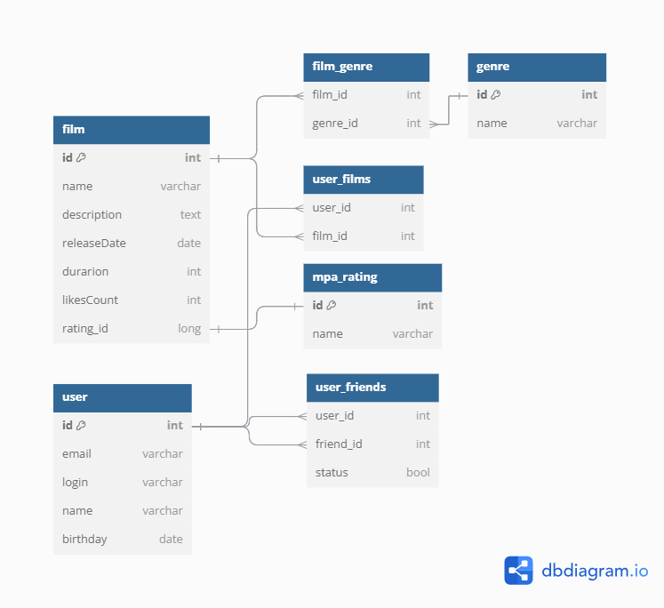

# java-filmorate
# ER-диаграмма 

# Таблица film
Все фильмы
# Таблица user
Все пользователи
# Таблица user_films
Лайкнутые фильмы пользователя можно получить через соединительную таблицу user_films. Так же через таблицу user_films можно получить список пользователей, которые лайкнули фильм или подсчитать самый популярный фильм. Позволяет реализовать связь Many to many.
# Таблица mpa_rating
Таблица справочник рейтингов фильмов - связь с таблицей фильмав One to many
# Таблица genre
Справочник жанров
# Таблица film_genre
Соединительная таблица - соединяющая таблица жанров и фильмов. У фильма может быть несколько жанров и по каждому из жанров позволяет получть список фильмов в этом жанре. Позволяет реализовать связь Many to many.
# Таблица user_friends
Соединительная таблица которая позволяет устновить связь пользователей с пользователями(друзья). Дополнительное поле - status позволяет определить была ли подтвержена дружба.

